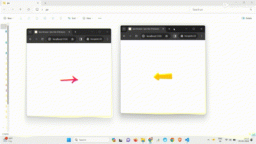

# Sync Browser : Sync Pair of Browsers

## Overview

Sync-Browser is a fun web app that allows you to collaborate in real-time across different browser tabs. Watch arrows changing directions together as you move your browser tab on the screen, creating a lively and engaging visual experience.

**Explore Sync Browser [here](https://ankitjha2603.github.io/sync-browser/).**

## Key Features

- **Interactive Arrow Synchronization:** Arrows dynamically adjust directions in real-time, showcasing collaboration visually.

- **Intuitive Geometry and Movement:** Arrows intelligently move based on tab positions, creating a visually satisfying and interactive display.

- **Continuous Exploration:** Sync-Browser operates in a continuous animation loop, allowing fluid and enjoyable exploration of dynamic arrow synchronization.

## Technologies Used

- **HTML5**: Used for structuring the content of the web page.
- **CSS4**: Employed for styling and layout purposes, enhancing the visual presentation.
- **JavaScript**: Implemented for dynamic behavior and interactivity on the client side.
- **LocalStorage**: Utilized for storing data locally in the user's browser, allowing collaboration and sharing of data between multiple browser tabs.
